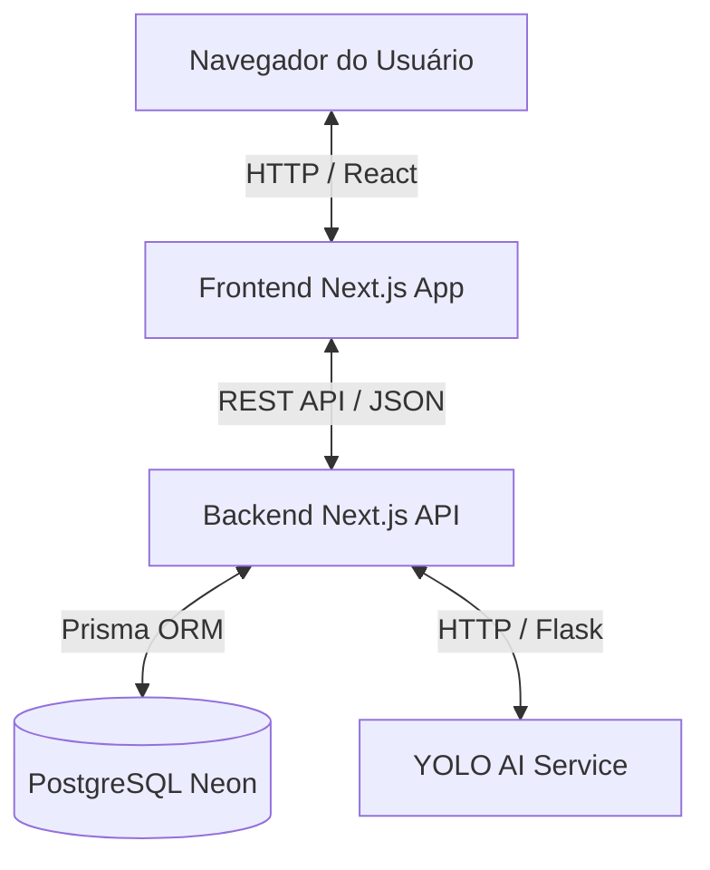

# Arquitetura do Sistema InspectAI

Este documento descreve a arquitetura técnica de alto nível do InspectAI, detalhando as responsabilidade de cada componente, fluxos de dados principais e o modelo de segurança do sistema.

## Visão Geral do Sistema

O InspectAI é um sistema distribuído para inspeção de placas eletrônicas e detecção automatizada de defeitos usando inteligência artificial. O sistema é estruturado em três camadas principais:

1. **Frontend (Next.js)**: Interface Web moderna que permite ao operador interagir com o sistema, realizar logins, carregar imagens individuais ou em lote, visualizar relatórios e cadastrar modelos de placas.
2. **Backend (Next.js API)**: Camada de negócios e persistência. Expõe APIs RESTful, implementa autenticação JWT, valida permissões baseadas em funções (RBAC), manipula os dados via Prisma ORM e coordena as requisições ao serviço de IA e geração de relatórios (PDF).
3. **Serviço de IA (YOLO v8 via Flask)**: Microsserviço responsável pela inferência de IA. Carrega o modelo YOLO (`best.pt`) e expõe endpoints para processar imagens e vídeos temporários retornando caixas delimitadoras (bounding boxes), classes e níveis de confiança de defeitos.

---

## Componentes Principais

### 1. Frontend Next.js (Porta `3000`)
- **Tecnologias**: React, Next.js (App Router), Recharts (para dashboards), Tailwind CSS, Sonner (notificações).
- **Responsabilidades**:
  - Renderização das páginas do usuário (`app/imagens`, `app/defeitos`, `app/relatorios`, `app/usuarios`, `app/configuracoes`).
  - Chamadas de API ao backend através do serviço centralizado `services/api.js`.
  - Controle de visualização local usando o estado do usuário logado (armazenado no `localStorage`).

### 2. Backend Next.js API (Porta `3001`)
- **Tecnologias**: Next.js API Routes, Prisma Client, JWT, bcryptjs, `@react-pdf/renderer` (geração de relatórios).
- **Responsabilidades**:
  - Roteamento e Middleware de Segurança (`backend/src/middleware.js`).
  - Validação de entrada e mapeamento para formato relacional.
  - Orquestração de transações no banco de dados.
  - Proxy para o serviço de IA, recebendo o upload multipart e enviando para o microsserviço Flask.

### 3. Serviço de IA (Porta `5005` exposta, porta interna Flask `5000`)
- **Tecnologias**: Python, Flask, Ultralytics YOLOv8, OpenCV.
- **Responsabilidades**:
  - Carregamento assíncrono do arquivo de pesos `best.pt`.
  - Processamento e normalização de imagens para inferência.
  - Detecção de objetos (solda fria, componentes faltantes, pontes de solda, etc.) definidos em `data.yaml`.
  - Retorno formatado de anomalias com coordenadas `[x_min, y_min, x_max, y_max]`.

---

## Modelo de Segurança e Controle de Acesso (RBAC)

O InspectAI implementa controle de acesso baseado em cargo (Role-Based Access Control). Os cargos disponíveis no sistema são:

* **ADMINISTRADOR**: Acesso total ao sistema, incluindo cadastro/edição de usuários, edição administrativa de relatórios, cadastro/deleção de modelos de placas, e visualização dos dados.
* **FUNCIONARIO**: Acesso operacional. Permite realizar logins, executar análises individuais/lotes de imagens, visualizar o banco de defeitos e consultar relatórios. Bloqueado de alterar a estrutura do sistema (modelos), gerenciar usuários ou modificar o criador de relatórios.

### Fluxo do Middleware de Proteção
O middleware do backend (`backend/src/middleware.js`) intercepta todas as requisições das rotas de API `/api/*`:
1. Verifica a presença do token JWT no cabeçalho `Authorization: Bearer <token>`.
2. Decodifica e valida o token usando a chave secreta `JWT_SECRET`.
3. Extrai as informações de `cargo` do usuário logado.
4. Aplica regras específicas por rota:
   - Rotas `/api/usuarios*` exigem cargo `ADMINISTRADOR`.
   - Modificações em `/api/modelos` via `DELETE` ou `PUT` exigem `ADMINISTRADOR`.
   - Modificações administrativas em `/api/relatorios/:id` via `PATCH`/`PUT` (como alterar placa associada) exigem `ADMINISTRADOR`.
5. Se a validação falhar, retorna `403 Forbidden` ou `401 Unauthorized`.

---

## Fluxo de Processamento de Detecção e Persistência

Para garantir flexibilidade operacional, a detecção de defeitos é dividida em duas fases distintas:

### Fase 1: Análise Temporária (Sem Escrita no Banco)
1. O usuário faz o upload de uma imagem ou lote na interface.
2. O Frontend envia a requisição para `POST /api/detection`.
3. O Backend envia os arquivos temporários via HTTP para o `YOLO AI Service` (`POST /predict`).
4. O serviço de IA retorna os defeitos encontrados.
5. O Backend envia a resposta de volta ao Frontend com o preview mapeado na tela do usuário.

### Fase 2: Salvamento Definitivo (Escrita no Banco)
1. O operador analisa visualmente o resultado temporário.
2. O operador decide salvar as informações clicando em **Confirmar e Salvar**.
3. O Frontend faz um POST para `POST /api/detection/save` com o código do modelo, tipo de fonte e a lista de detecções confirmadas.
4. O Backend cria o registro da placa e vincula o relatório. O usuário logado é associado imutavelmente como `id_usuario_criador`.
5. Os defeitos são gravados na tabela `defeito` vinculados à placa.
